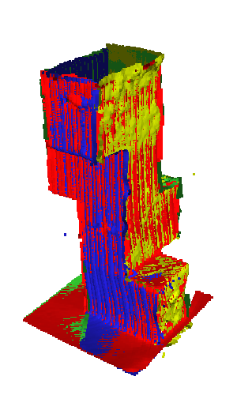
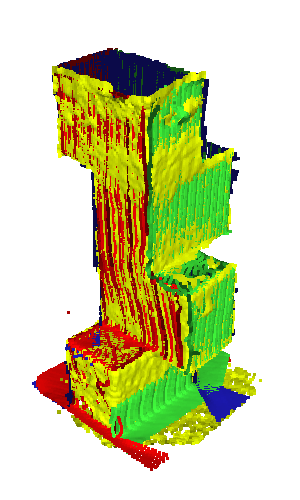
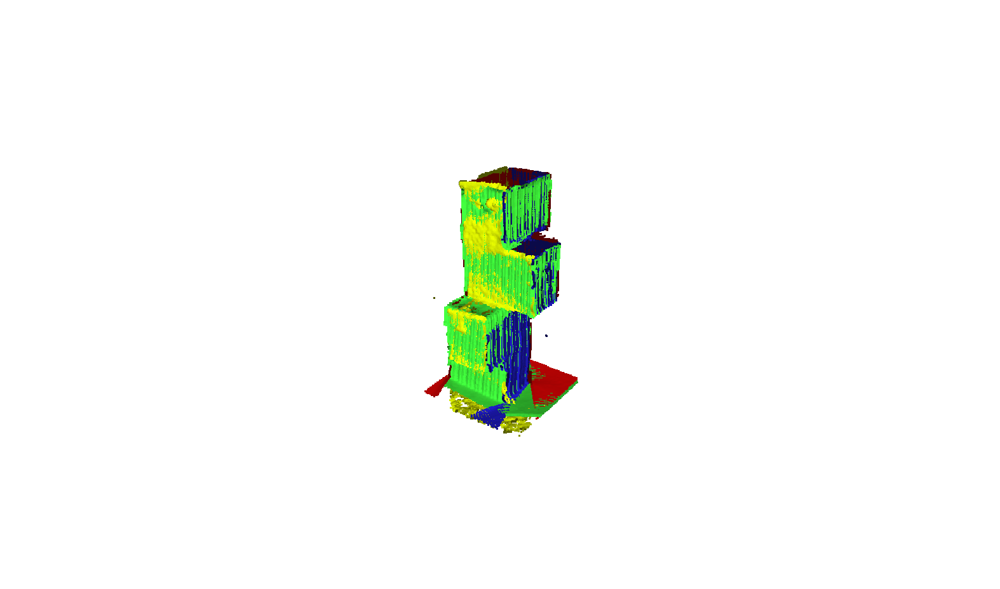
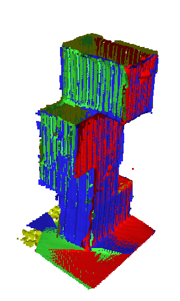

# Deep Soft Procrustes for Markerless Volumetric Sensor Alignment
An easy to use depth sensor extrinsics calibration method. It is integrated and being used in a robust [Volumetric Capture](https://vcl3d.github.io/VolumetricCapture/) system.

<!--
| [Project Page](https://vcl3d.github.io/StructureNet/) | [Paper](https://arxiv.org/pdf/2003.10176.pdf) | ~~[Supplementary Material]~~ |
|:-----:|:------:|:------:|
-->
[](https://arxiv.org/pdf/2003.10176.pdf)
[](http://ieeevr.org/2020/)
[](https://vcl3d.github.io/StructureNet/)

## Abstract

With the advent of consumer grade depth sensors, low-cost volumetric capture systems are easier to deploy. Their wider adoption though depends on their usability and by extension on the practicality of spatially aligning multiple sensors. Most existing alignment approaches employ visual patterns, e.g. checkerboards, or markers and require high user involvement and technical knowledge. More user-friendly and easier-to-use approaches rely on markerless methods that exploit geometric patterns of a physical structure. However, current SoA approaches are bounded by restrictions in the placement and the number of sensors. In this work, we improve markerless data-driven correspondence estimation to achieve more robust and flexible multi-sensor spatial alignment. In particular, we incorporate geometric constraints in an end-to-end manner into a typical segmentation based model and bridge the intermediate dense classification task with the targeted pose estimation one. This is accomplished by a soft, differentiable procrustes analysis that regularizes the segmentation and achieves higher extrinsic calibration performance in expanded sensor placement configurations, while being unrestricted by the number of sensors of the volumetric capture system. Our model is experimentally shown to achieve similar results with marker-based methods and outperform the markerless ones, while also being robust to the pose variations of the calibration structure.

   

## Requirements
- Python 3.6.7
- [PyTorch 1.2 + cuda 9.2](https://pytorch.org/get-started/previous-versions/#v120)

## Installation
(New python enviroment is highly recommended)
- Install required packages with `pip install -r requirements.txt`
**Only for training**
- Install [tinyobjloader](https://github.com/tinyobjloader/tinyobjloader) by cloning/downloading this repository, navigate to python folder and run `python setup.py install`
- Install our custom patch for disabling multisampling in pyrender
  - Download [UnixUtils](https://sourceforge.net/projects/unxutils/files/latest/download) and add the executable to path
  - Execute `patch.exe -u <path_to renderer.py>  pyrender_patch/renderer.diff`
  - Execute `patch.exe -u <path_to constants.py>  pyrender_patch/constants.diff`
  - Execute `patch.exe -u <path_to camera.py>  pyrender_patch/camera.diff`

## Download the model
We provide a pretrained model [here](https://drive.google.com/file/d/1e3nZRYTsNRD1Nn8_48tpFTmYa4EZdraz) for inference purposes.

## Inference
In order to run our code, a pretrained model must be present either from a training or it can be downloaded [here](#download-the-model).
Once every requirement is installed, simply rum `python inference.py [options...]`

**Important options**

`--input_path` : directory which contains depthmaps (in .pgm format) (see [example of input data](./example) )

`--output_path` : directory where results will be saved

`--scale` : multiplication factor that converts depthmap data to meters

`--saved_params_path` : path to the downloaded model

In order to see all available options with a brief description, please execute `python inference.py -h`

## Training
In order to train our model from scratch, one has to download backgrounds that are used in training time for augmentation.
**TBD: upload and add links**.
Once every requirement is installed and backgrounds are downloaded, it is time to train our model.
Execute `python main.py -h` to see all available options.

# Citation
If you use this code and/or models, please cite the following:
```
@inproceedings{sterzentsenko2020deepsoftprocrustes,
  title={Deep Soft Procrustes for Markerless Volumetric Sensor Alignment},
  author={Vladimiros Sterzentsenko and Alexandros Doumanoglou and Spyridon Thermos and Nikolaos Zioulis and and Dimitrios Zarpalas and Petros Daras},
  booktitle={2020 IEEE Conference on Virtual Reality and 3D User Interfaces (VR)},
  year={2020},
  organization={IEEE}
}
```
