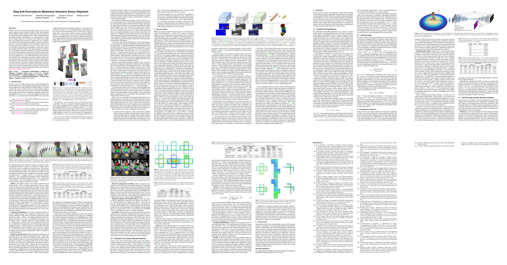

# Abstract

With the advent of consumer grade depth sensors, low-cost volumetric capture systems are easier to deploy. 
Their wider adoption though depends on their usability and by extension on the practicality of spatially aligning multiple sensors. Most existing alignment approaches employ visual patterns, _e.g._ checkerboards, or markers and require high user involvement and technical knowledge. More user-friendly and easier-to-use approaches rely on markerless methods that exploit geometric patterns of a physical structure. However, current SoA approaches are bounded by restrictions in the placement and the number of sensors. **In this work, we improve markerless data-driven correspondence estimation** to achieve more robust and flexible multi-sensor spatial alignment. In particular, we incorporate geometric constraints in an end-to-end manner into a typical segmentation based model and bridge the intermediate dense classification task with the targeted pose estimation one. This is accomplished by a soft, differentiable procrustes analysis that regularizes the segmentation and achieves higher extrinsic calibration performance in expanded sensor placement configurations, while being unrestricted by the number of sensors of the volumetric capture system. Our model is experimentally shown to achieve similar results with marker-based methods and outperform the markerless ones, while also being robust to the pose variations of the calibration structure.

# Overview


<iframe width="660" height="371" src="https://www.youtube.com/embed/0l5neSMt-2Y" frameborder="0" allow="accelerometer; autoplay; encrypted-media; gyroscope; picture-in-picture" allowfullscreen></iframe>


# Concept
Concept goes here


# Publication

# Authors
[Vladimiros Sterzentsenko](https://github.com/vladsterz) __\*__, [Alexandros Doumanoglou](https://github.com/aldoumiti) __\*__, [Spyridon Thermos](https://github.com/spthermo), [Nikolaos](https://github.com/zokin) [Zioulis](https://github.com/zuru), [Dimitrios Zarpalas](https://www.iti.gr/iti/people/Dimitrios_Zarpalas.html), and [Petros Daras](https://www.iti.gr/iti/people/Petros_Daras.html)

[Visual Computing Lab (VCL)](https://vcl.iti.gr)

# Citation
If you use this code and/or models, please cite the following:
```
@inproceedings{sterzentsenko2020deepsoftprocrustes,
  title={Deep Soft Procrustes for Markerless Volumetric Sensor Alignment},
  author={Vladimiros Sterzentsenko and Alexandros Doumanoglou and Spyridon Thermos and Nikolaos Zioulis and and Dimitrios Zarpalas and Petros Daras},
  booktitle={2020 IEEE Conference on Virtual Reality and 3D User Interfaces (VR)},
  year={2020},
  organization={IEEE}
}
```

# Acknowledgements
This project has received funding from the European Union’s Horizon 2020 innovation programme [Hyper360](https://hyper360.eu/) under grant agreement No 761934.

 We would like to thank NVIDIA for supporting our research with GPU donations through the NVIDIA GPU Grant Program.

{:width="150px"} {:width="150px"} {:width="150px"}
# Contact
Please direct any questions related to the code & models to vladster “at” iti “dot” gr or post an issue to the code [repo](https://github.com/VCL3D/StructureNet).
